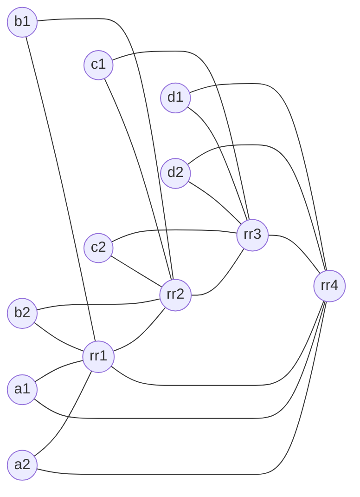

# BGP ORR with 4 Regional RR Clusters (cRPD + containerlab)

This lab demonstrates BGP Optimal Route Reflection (ORR) with four regional route reflector (RR) clusters. Each cluster has two clients. The topology uses iBGP everywhere and IS-IS as the underlay IGP. ORR is configured per region using `optimal-route-reflection` with `igp-primary` and `igp-backup`.

The key idea is to show how ORR lets an RR select a best path based on the IGP view of a client location, not the RR's own IGP perspective.

## Topology summary

- 4 regions: A, B, C, D
- 4 RRs: `rr1`–`rr4`
- 8 clients: `a1 a2 b1 b2 c1 c2 d1 d2`
- iBGP between each RR and its two clients
- iBGP full mesh between RRs
- IS-IS L2 across all nodes
- ORR enabled on each RR for its regional client group

Clients are dual-homed into the IGP (to their regional RR and the adjacent RR) to create different IGP viewpoints between the RR and the client group. This allows ORR to actually change the chosen egress for a shared prefix.

## Topology diagram



## What ORR does in this lab

Two clients originate the same prefix `198.51.100.0/24`:

- `c1` (Region C)
- `d1` (Region D)

Without ORR, `rr1` would select the best path based on its own IGP distances. With ORR enabled and the `igp-primary` set to `a1`, `rr1` selects the best path based on `a1`'s IGP view. Because `a1` is closer (IGP-wise) to Region D in this lab, ORR causes `rr1` to reflect the `d1` path to its clients, even though `rr1` itself is closer to `c1`.

## ORR fundamentals (quick refresher)

- ORR improves RR path selection by using a client's IGP view instead of the RR's local IGP view.
- ORR is enabled per BGP peer group with `optimal-route-reflection`.
- A client group should share similar IGP topology.
- You set one client as `igp-primary` and optionally an `igp-backup`.
- ORR only works when the BGP next-hop is resolved in the IGP (inet.0), not when MPLS/LDP/RSVP resolves the next-hop.

## Files

- `bgp-orr-4rr.clab.yml`: containerlab topology
- `configs/`: startup configs for each node

## Prereqs

1. Linux host with Docker installed
2. containerlab installed
3. cRPD image loaded into Docker

This lab uses `crpd:24.2R1.14` in the topology file. If you have a newer stable tag, update the `image:` field in `bgp-orr-4rr.clab.yml`.

## cRPD interface and IS-IS notes (important)

These are cRPD-specific behaviors that will break IS-IS if you use Junos/vMX-style config:

- Data-plane interfaces are `eth1`, `eth2`, ... (not `ge-0/0/x`).
- IS-IS is configured on the parent interface, not a unit:
  - `set protocols isis interface eth1 point-to-point`
  - `set protocols isis interface eth1 level 2 metric 10`
- `family iso` is not supported on `eth*` in this cRPD build. Only keep the NET under `protocols isis net` and `lo0.0` passive.

If you see no IS-IS adjacencies, first confirm you are not using `ethX.0` in IS-IS or `family iso` on `eth*`.

## Deploy

```bash
sudo containerlab deploy -t bgp-orr-4rr.clab.yml
```

Check that all nodes are running:

```bash
root@ubuntu-22-04:~/bgp-orr# containerlab inspect -t bgp-orr-4rr.clab.yml
16:32:40 INFO Parsing & checking topology file=bgp-orr-4rr.clab.yml
╭──────────────────────┬──────────────────┬─────────┬───────────────────╮
│         Name         │    Kind/Image    │  State  │   IPv4/6 Address  │
├──────────────────────┼──────────────────┼─────────┼───────────────────┤
│ clab-bgp-orr-4rr-a1  │ juniper_crpd     │ running │ 172.20.20.9       │
│                      │ crpd:24.4R2-S3.5 │         │ 3fff:172:20:20::9 │
├──────────────────────┼──────────────────┼─────────┼───────────────────┤
│ clab-bgp-orr-4rr-a2  │ juniper_crpd     │ running │ 172.20.20.7       │
│                      │ crpd:24.4R2-S3.5 │         │ 3fff:172:20:20::7 │
├──────────────────────┼──────────────────┼─────────┼───────────────────┤
│ clab-bgp-orr-4rr-b1  │ juniper_crpd     │ running │ 172.20.20.5       │
│                      │ crpd:24.4R2-S3.5 │         │ 3fff:172:20:20::5 │
├──────────────────────┼──────────────────┼─────────┼───────────────────┤
│ clab-bgp-orr-4rr-b2  │ juniper_crpd     │ running │ 172.20.20.11      │
│                      │ crpd:24.4R2-S3.5 │         │ 3fff:172:20:20::b │
├──────────────────────┼──────────────────┼─────────┼───────────────────┤
│ clab-bgp-orr-4rr-c1  │ juniper_crpd     │ running │ 172.20.20.13      │
│                      │ crpd:24.4R2-S3.5 │         │ 3fff:172:20:20::d │
├──────────────────────┼──────────────────┼─────────┼───────────────────┤
│ clab-bgp-orr-4rr-c2  │ juniper_crpd     │ running │ 172.20.20.8       │
│                      │ crpd:24.4R2-S3.5 │         │ 3fff:172:20:20::8 │
├──────────────────────┼──────────────────┼─────────┼───────────────────┤
│ clab-bgp-orr-4rr-d1  │ juniper_crpd     │ running │ 172.20.20.4       │
│                      │ crpd:24.4R2-S3.5 │         │ 3fff:172:20:20::4 │
├──────────────────────┼──────────────────┼─────────┼───────────────────┤
│ clab-bgp-orr-4rr-d2  │ juniper_crpd     │ running │ 172.20.20.12      │
│                      │ crpd:24.4R2-S3.5 │         │ 3fff:172:20:20::c │
├──────────────────────┼──────────────────┼─────────┼───────────────────┤
│ clab-bgp-orr-4rr-rr1 │ juniper_crpd     │ running │ 172.20.20.3       │
│                      │ crpd:24.4R2-S3.5 │         │ 3fff:172:20:20::3 │
├──────────────────────┼──────────────────┼─────────┼───────────────────┤
│ clab-bgp-orr-4rr-rr2 │ juniper_crpd     │ running │ 172.20.20.2       │
│                      │ crpd:24.4R2-S3.5 │         │ 3fff:172:20:20::2 │
├──────────────────────┼──────────────────┼─────────┼───────────────────┤
│ clab-bgp-orr-4rr-rr3 │ juniper_crpd     │ running │ 172.20.20.6       │
│                      │ crpd:24.4R2-S3.5 │         │ 3fff:172:20:20::6 │
├──────────────────────┼──────────────────┼─────────┼───────────────────┤
│ clab-bgp-orr-4rr-rr4 │ juniper_crpd     │ running │ 172.20.20.10      │
│                      │ crpd:24.4R2-S3.5 │         │ 3fff:172:20:20::a │
╰──────────────────────┴──────────────────┴─────────┴───────────────────╯
root@ubuntu-22-04:~/bgp-orr#
```

## Validate IGP

On any node (example `rr1`):

```bash
docker exec -it clab-bgp-orr-4rr-rr1 cli

root@rr1> show isis adjacency
Interface             System         L State         Hold (secs) SNPA
eth1                  rr2            3  Up                    26
eth2                  rr4            3  Up                    24
eth3                  a1             3  Up                    20
eth4                  a2             3  Up                    21
eth5                  b1             3  Up                    21
eth6                  b2             3  Up                    23

root@rr1> show route protocol isis

inet.0: 49 destinations, 51 routes (49 active, 0 holddown, 0 hidden)
+ = Active Route, - = Last Active, * = Both

10.0.0.2/32        *[IS-IS/15] 1d 06:12:20, metric 10
                    >  to 172.16.0.1 via eth1
10.0.0.3/32        *[IS-IS/15] 1d 06:12:14, metric 20
                       to 172.16.0.1 via eth1
                    >  to 172.16.0.6 via eth2
10.0.0.4/32        *[IS-IS/15] 1d 06:12:14, metric 10
                    >  to 172.16.0.6 via eth2
10.0.1.1/32        *[IS-IS/15] 1d 06:12:20, metric 10
                    >  to 172.16.0.9 via eth3
10.0.1.2/32        *[IS-IS/15] 1d 06:12:20, metric 10
                    >  to 172.16.0.13 via eth4
10.0.1.11/32       *[IS-IS/15] 1d 06:12:14, metric 10
                    >  to 172.16.0.19 via eth5
10.0.1.12/32       *[IS-IS/15] 1d 06:12:25, metric 10
                    >  to 172.16.0.23 via eth6
10.0.1.21/32       *[IS-IS/15] 1d 06:12:20, metric 20
                    >  to 172.16.0.1 via eth1
10.0.1.22/32       *[IS-IS/15] 1d 06:12:09, metric 20
                    >  to 172.16.0.1 via eth1
10.0.1.31/32       *[IS-IS/15] 1d 06:12:14, metric 20
                    >  to 172.16.0.6 via eth2
10.0.1.32/32       *[IS-IS/15] 1d 06:12:09, metric 20
                    >  to 172.16.0.6 via eth2
172.16.0.2/31      *[IS-IS/15] 1d 06:12:20, metric 20
                    >  to 172.16.0.1 via eth1
172.16.0.4/31      *[IS-IS/15] 1d 06:12:14, metric 20
                    >  to 172.16.0.6 via eth2
172.16.0.6/31       [IS-IS/18] 00:03:13, metric 25
                       to 172.16.0.9 via eth3
                       to 172.16.0.13 via eth4
                    >  to 172.16.0.19 via eth5
                       to 172.16.0.23 via eth6
172.16.0.10/31     *[IS-IS/15] 1d 06:12:20, metric 20
                    >  to 172.16.0.6 via eth2
                       to 172.16.0.9 via eth3
172.16.0.14/31     *[IS-IS/15] 1d 06:12:14, metric 20
                    >  to 172.16.0.6 via eth2
                       to 172.16.0.13 via eth4
172.16.0.16/31     *[IS-IS/15] 1d 06:12:14, metric 20
                       to 172.16.0.1 via eth1
                    >  to 172.16.0.19 via eth5
172.16.0.20/31     *[IS-IS/15] 1d 06:12:20, metric 20
                       to 172.16.0.1 via eth1
                    >  to 172.16.0.23 via eth6
172.16.0.24/31     *[IS-IS/15] 1d 06:12:14, metric 30
                    >  to 172.16.0.1 via eth1
                       to 172.16.0.6 via eth2
172.16.0.26/31     *[IS-IS/15] 1d 06:12:20, metric 20
                    >  to 172.16.0.1 via eth1
172.16.0.28/31     *[IS-IS/15] 1d 06:12:14, metric 30
                    >  to 172.16.0.1 via eth1
                       to 172.16.0.6 via eth2
172.16.0.30/31     *[IS-IS/15] 1d 06:12:20, metric 20
                    >  to 172.16.0.1 via eth1
172.16.0.32/31     *[IS-IS/15] 1d 06:12:14, metric 20
                    >  to 172.16.0.6 via eth2
172.16.0.34/31     *[IS-IS/15] 1d 06:12:14, metric 30
                       to 172.16.0.1 via eth1
                    >  to 172.16.0.6 via eth2
172.16.0.36/31     *[IS-IS/15] 1d 06:12:14, metric 20
                    >  to 172.16.0.6 via eth2
172.16.0.38/31     *[IS-IS/15] 1d 06:12:09, metric 30
                       to 172.16.0.1 via eth1
                    >  to 172.16.0.6 via eth2

inet6.0: 18 destinations, 21 routes (18 active, 0 holddown, 0 hidden)

root@rr1> show isis bgp-orr
BGP ORR Peer Group: CLIENTS
  Primary: 10.0.1.1, active
  Backup: 10.0.1.2
IPv4/IPv6 ORR Routes
--------------------
Prefix                  L Version   Metric Type
10.0.0.2/32             1     197       20 int
10.0.0.3/32             1     197       20 int
10.0.0.4/32             1     197       10 int
10.0.1.1/32             1     197        0 int
10.0.1.2/32             1     197       20 int
10.0.1.11/32            1     197       20 int
10.0.1.12/32            1     197       20 int
10.0.1.21/32            1     197       30 int
10.0.1.22/32            1     197       30 int
10.0.1.31/32            1     197       20 int
10.0.1.32/32            1     197       20 int
172.16.0.2/31           1     197       30 int
172.16.0.4/31           1     197       20 int
172.16.0.6/31           2     202       20 int
172.16.0.10/31          1     197       10 int
172.16.0.14/31          1     197       20 int
172.16.0.16/31          1     197       30 int
172.16.0.20/31          1     197       30 int
172.16.0.24/31          1     197       30 int
172.16.0.26/31          1     197       30 int
172.16.0.28/31          1     197       30 int
172.16.0.30/31          1     197       30 int
172.16.0.32/31          1     197       20 int
172.16.0.34/31          1     197       30 int
172.16.0.36/31          1     197       20 int
172.16.0.38/31          1     197       30 int

```

## Validate BGP

On `rr1`:

```bash
root@rr1> show bgp summary
Threading mode: BGP I/O
Default eBGP mode: advertise - accept, receive - accept
Groups: 2 Peers: 5 Down peers: 0
Table          Tot Paths  Act Paths Suppressed    History Damp State    Pending
inet.0
                      10          9          0          0          0          0
Peer                     AS      InPkt     OutPkt    OutQ   Flaps Last Up/Dwn State|#Active/Received/Accepted/Damped...
10.0.0.2              65000       3976       3975       0       0  1d 6:09:34 Establ
  inet.0: 2/2/2/0
10.0.0.3              65000       3976       3974       0       0  1d 6:09:30 Establ
  inet.0: 3/3/3/0
10.0.0.4              65000       3975       3974       0       0  1d 6:09:30 Establ
  inet.0: 2/3/3/0
10.0.1.1              65000       4030       3979       0       0  1d 6:09:28 Establ
  inet.0: 1/1/1/0
10.0.1.2              65000       4030       3979       0       0  1d 6:09:26 Establ
  inet.0: 1/1/1/0

root@rr1> show bgp group clients
Group Type: Internal    AS: 65000                  Local AS: 65000
  Name: CLIENTS         Index: 1                   Flags: <>
  Options: <Cluster>
  Options: <GracefulShutdownRcv>
  Holdtime: 90 Preference: 0
  Graceful Shutdown Receiver local-preference: 0
  Optimal route reflection: igp-primary 10.0.1.1 igp-backup 10.0.1.2
  Total peers: 2        Established: 2
  10.0.1.1+55433
  10.0.1.2+55511
  inet.0: 2/2/2/0

root@rr1> show route 198.51.100.0/24 detail

inet.0: 49 destinations, 51 routes (49 active, 0 holddown, 0 hidden)
198.51.100.0/24 (2 entries, 2 announced)
        *BGP    Preference: 170/-101
                Next hop type: Indirect, Next hop index: 0
                Address: 0x55c5580e573c
                Next-hop reference count: 4
                Kernel Table Id: 0
                Source: 10.0.0.3
                Next hop type: Router, Next hop index: 0
                Next hop: 172.16.0.1 via eth1, selected
                Session Id: 0
                Protocol next hop: 10.0.1.21
                Indirect next hop: 0x55c5581c6f88 - INH Session ID: 0
                Indirect next hop: INH non-key opaque: (nil) INH key opaque: (nil)
                State: <Active Int Ext>
                Local AS: 65000 Peer AS: 65000
                Age: 1d 6:16:19 	Metric2: 20
                Validation State: unverified
                ORR Generation-ID: 1
                Task: BGP_65000.10.0.0.3
                Announcement bits (3): 1-KRT MFS 2-KRT 6-Resolve tree 4
                AS path: I  (Originator)
                Cluster list:  10.0.0.3
                Originator ID: 10.0.1.21
                Accepted
                Localpref: 100
                Router ID: 10.0.0.3
                Thread: junos-main
         BGP    Preference: 170/-101
                Next hop type: Indirect, Next hop index: 0
                Address: 0x55c5580e629c
                Next-hop reference count: 3
                Kernel Table Id: 0
                Source: 10.0.0.4
                Next hop type: Router, Next hop index: 0
                Next hop: 172.16.0.6 via eth2, selected
                Session Id: 0
                Protocol next hop: 10.0.1.31
                Indirect next hop: 0x55c5581c7708 - INH Session ID: 0
                Indirect next hop: INH non-key opaque: (nil) INH key opaque: (nil)
                State: <NotBest Int Ext>
                Inactive reason: Not Best in its group - Router ID
                Local AS: 65000 Peer AS: 65000
                Age: 1d 6:16:15 	Metric2: 20
                Validation State: unverified
                ORR Generation-ID: 1
                Task: BGP_65000.10.0.0.4
                Announcement bits (1): 5-BGP_RT_Background
                AS path: I  (Originator)
                Cluster list:  10.0.0.4
                Originator ID: 10.0.1.31
                Accepted
                Localpref: 100
                Router ID: 10.0.0.4
                Thread: junos-main
```

On `a1`:

```bash

root@a1> show route 198.51.100.0/24 detail

inet.0: 45 destinations, 45 routes (45 active, 0 holddown, 0 hidden)
198.51.100.0/24 (1 entry, 1 announced)
        *BGP    Preference: 170/-101
                Next hop type: Indirect, Next hop index: 0
                Address: 0x55d2af8e565c
                Next-hop reference count: 4
                Kernel Table Id: 0
                Source: 10.0.0.1
                Next hop type: Router, Next hop index: 0
                Next hop: 172.16.0.10 via eth2, selected
                Session Id: 0
                Protocol next hop: 10.0.1.31
                Indirect next hop: 0x55d2af9c1308 - INH Session ID: 0
                Indirect next hop: INH non-key opaque: (nil) INH key opaque: (nil)
                State: <Active Int Ext>
                Local AS: 65000 Peer AS: 65000
                Age: 1d 6:18:17 	Metric2: 20
                Validation State: unverified
                ORR Generation-ID: 0
                Task: BGP_65000.10.0.0.1
                Announcement bits (3): 1-KRT MFS 2-KRT 7-Resolve tree 4
                AS path: I  (Originator)
                Cluster list:  10.0.0.1 10.0.0.4
                Originator ID: 10.0.1.31
                Accepted
                Localpref: 100
                Router ID: 10.0.0.1
                Thread: junos-main

```

You should see that the chosen next-hop for `198.51.100.0/24` aligns with `d1` when ORR is enabled.

## ORR verification commands

On `rr1`:

```bash
root@rr1> show configuration protocols bgp group CLIENTS
type internal;
local-address 10.0.0.1;
family inet {
    unicast;
}
cluster 10.0.0.1;
optimal-route-reflection {
    igp-primary 10.0.1.1;
    igp-backup 10.0.1.2;
}
neighbor 10.0.1.1;
neighbor 10.0.1.2;

root@rr1> show isis database detail | match "a1|d1|c1"
   IS neighbor: a1.00                         Metric:       10
   IS neighbor: c1.00                         Metric:       10
   IS neighbor: c1.00                         Metric:       10
   IS neighbor: d1.00                         Metric:       10
   IS neighbor: a1.00                         Metric:       10
   IS neighbor: d1.00                         Metric:       10
a1.00-00 Sequence: 0xbb, Checksum: 0x9e54, Lifetime: 948 secs
c1.00-00 Sequence: 0xbc, Checksum: 0x308, Lifetime: 427 secs
d1.00-00 Sequence: 0xbd, Checksum: 0x6231, Lifetime: 665 secs
   IS neighbor: a1.00                         Metric:        5
   IS neighbor: c1.00                         Metric:        5
   IS neighbor: c1.00                         Metric:        5
   IS neighbor: d1.00                         Metric:        5
   IS neighbor: a1.00                         Metric:        5
   IS neighbor: d1.00                         Metric:        5
a1.00-00 Sequence: 0xbf, Checksum: 0x8017, Lifetime: 1066 secs
b1.00-00 Sequence: 0xc1, Checksum: 0x8908, Lifetime: 1150 secs
c1.00-00 Sequence: 0xc2, Checksum: 0x41d4, Lifetime: 552 secs
d1.00-00 Sequence: 0xbf, Checksum: 0x6a6e, Lifetime: 526 secs

```

## Demonstration: ORR on vs off

1. Capture current best path on `a1`:

```bash
root@a1> show route 198.51.100.0/24 detail

inet.0: 45 destinations, 45 routes (45 active, 0 holddown, 0 hidden)
198.51.100.0/24 (1 entry, 1 announced)
        *BGP    Preference: 170/-101
                Next hop type: Indirect, Next hop index: 0
                Address: 0x55d2af8e565c
                Next-hop reference count: 4
                Kernel Table Id: 0
                Source: 10.0.0.1
                Next hop type: Router, Next hop index: 0
                Next hop: 172.16.0.10 via eth2, selected
                Session Id: 0
                Protocol next hop: 10.0.1.31
                Indirect next hop: 0x55d2af9c1308 - INH Session ID: 0
                Indirect next hop: INH non-key opaque: (nil) INH key opaque: (nil)
                State: <Active Int Ext>
                Local AS: 65000 Peer AS: 65000
                Age: 1d 6:18:17 	Metric2: 20
                Validation State: unverified
                ORR Generation-ID: 0
                Task: BGP_65000.10.0.0.1
                Announcement bits (3): 1-KRT MFS 2-KRT 7-Resolve tree 4
                AS path: I  (Originator)
                Cluster list:  10.0.0.1 10.0.0.4
                Originator ID: 10.0.1.31
                Accepted
                Localpref: 100
                Router ID: 10.0.0.1
                Thread: junos-main
```

2. Disable ORR on `rr1`:

```bash

root@rr1> edit
Entering configuration mode

[edit]
root@rr1# deactivate protocols bgp group CLIENTS optimal-route-reflection

[edit]
root@rr1# commit and-quit
commit complete
Exiting configuration mode

```

3. Re-check on `a1`:

```bash
show route 198.51.100.0/24 detail

root@a1> show route 198.51.100.0/24 detail

inet.0: 45 destinations, 45 routes (45 active, 0 holddown, 0 hidden)
198.51.100.0/24 (1 entry, 1 announced)
        *BGP    Preference: 170/-101
                Next hop type: Indirect, Next hop index: 0
                Address: 0x55d2af8e4d9c
                Next-hop reference count: 4
                Kernel Table Id: 0
                Source: 10.0.0.1
                Next hop type: Router, Next hop index: 0
                Next hop: 172.16.0.8 via eth1, selected
                Session Id: 0
                Next hop: 172.16.0.10 via eth2
                Session Id: 0
                Protocol next hop: 10.0.1.21
                Indirect next hop: 0x55d2af9c0b88 - INH Session ID: 0
                Indirect next hop: INH non-key opaque: (nil) INH key opaque: (nil)
                State: <Active Int Ext>
                Local AS: 65000 Peer AS: 65000
                Age: 16 	Metric2: 30
                Validation State: unverified
                ORR Generation-ID: 0
                Task: BGP_65000.10.0.0.1
                Announcement bits (3): 1-KRT MFS 2-KRT 7-Resolve tree 4
                AS path: I  (Originator)
                Cluster list:  10.0.0.1 10.0.0.3
                Originator ID: 10.0.1.21
                Accepted
                Localpref: 100
                Router ID: 10.0.0.1
                Thread: junos-main

```

4. Re-enable ORR on `rr1`:

```bash

root@rr1> edit
Entering configuration mode

[edit]
root@rr1# activate protocols bgp group CLIENTS optimal-route-reflection

[edit]
root@rr1# commit and-quit
commit complete
Exiting configuration mode

root@a1> show route 198.51.100.0/24 detail

inet.0: 45 destinations, 45 routes (45 active, 0 holddown, 0 hidden)
198.51.100.0/24 (1 entry, 1 announced)
        *BGP    Preference: 170/-101
                Next hop type: Indirect, Next hop index: 0
                Address: 0x55d2af8e565c
                Next-hop reference count: 4
                Kernel Table Id: 0
                Source: 10.0.0.1
                Next hop type: Router, Next hop index: 0
                Next hop: 172.16.0.10 via eth2, selected
                Session Id: 0
                Protocol next hop: 10.0.1.31
                Indirect next hop: 0x55d2af9c1308 - INH Session ID: 0
                Indirect next hop: INH non-key opaque: (nil) INH key opaque: (nil)
                State: <Active Int Ext>
                Local AS: 65000 Peer AS: 65000
                Age: 56 	Metric2: 20
                Validation State: unverified
                ORR Generation-ID: 0
                Task: BGP_65000.10.0.0.1
                Announcement bits (3): 1-KRT MFS 2-KRT 7-Resolve tree 4
                AS path: I  (Originator)
                Cluster list:  10.0.0.1 10.0.0.4
                Originator ID: 10.0.1.31
                Accepted
                Localpref: 100
                Router ID: 10.0.0.1
                Thread: junos-main

```

## Addressing plan

### Loopbacks

- RRs: `10.0.0.1/32`–`10.0.0.4/32`
- Clients: `10.0.1.1/32`–`10.0.1.32/32`

### P2P links

All P2P links use `/31` under `172.16.0.0/24`. See `configs/` for exact mapping.

## Design notes

- RRs use `optimal-route-reflection` with `igp-primary` and `igp-backup` per region.
- IS-IS metrics are asymmetrical in the RR ring to ensure client vs RR IGP viewpoints differ.
- iBGP uses loopback addresses and relies on IS-IS for reachability.

## Cleanup

```bash
sudo containerlab destroy -t bgp-orr-4rr.clab.yml
```
